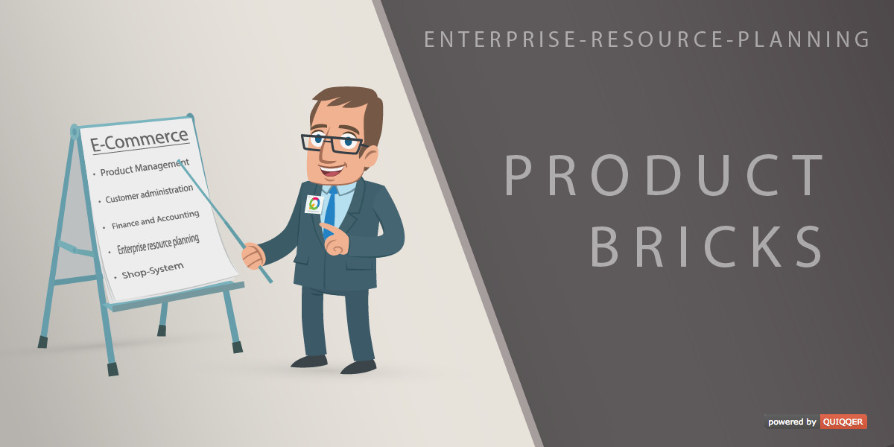

QUIQQER Product Bricks
========

The Product Bricks module extends QUIQQER shops with ready-to-use bricks for
presenting products in sliders, category boxes, grids, and promotional
layouts.

It helps you build sales-focused landing pages and category teasers without
creating custom frontend components from scratch.

Package name:

    quiqqer/product-bricks

Features
--------

#### Product slider
- Select products or categories to highlight them in a large stage slider.
- Configure autoplay, slide delay, background color, and background image.
- Optionally show prices and variant child products.

#### Category boxes
- Display product categories as visual teaser boxes.
- Map shop categories to sites and use site images as box backgrounds.
- Add an optional "All categories" button that links to an overview page.

#### Horizontal product slider
- Show products in a compact, horizontally scrollable slider.
- Works on mobile devices and supports quick product navigation.
- Can be configured to link to the product or add it directly to the basket.

#### Product grids and promo bricks
- Present products in card grids with or without detail tables.
- Add promotional boxes with image, content, and link targets.
- Combine multiple brick types for shop start pages, teasers, and campaigns.

Installation
------------

The package name is: `quiqqer/product-bricks`

Contribution
----------

- Issue Tracker: https://dev.quiqqer.com/quiqqer/product-bricks/issues
- Source Code: https://dev.quiqqer.com/quiqqer/product-bricks
- Wiki: https://dev.quiqqer.com/quiqqer/product-bricks/wikis/home

Support
-------

If you have found a bug or want improvements, please send an e-mail to
support@pcsg.de.

License
-------
GPL-3.0+

